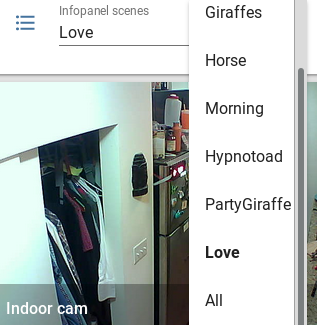

infopanel
=========

*Infopanel* puts live data, simple custom animations, images, animated gifs,
headlines, anything on a simple display panel. It currently works with a
Raspberry Pi and an RGB LED Matrix Screen (though other screens are envisioned
to be supported in the future). 

.. Note: I'm storing the videos as symlinks instead of embedding them in this repo. 

Here is an example with live travel times over I-90 and WA-520, as well as
high, low, and current temperature (in celcius). (The headlines are coming
directly from reddit, as you'll see below). 

.. raw:: html

    <video autoplay loop> 
        <source src="_static/traffic.webm" type="video/webm">
        <source src="_static/traffic.mp4" type="video/mp4">
    Your browser does not support the video tag.
    </video> 

Installation
------------
To install, first install the dependencies:

* `RPI-RGB-LED-MATRIX  <https://github.com/hzeller/rpi-rgb-led-matrix>`_

You may also need to run::

    sudo apt-get install libyaml-dev python-setuptools git python-matplotlib

We like running in a `virtual environment
<https://virtualenv.pypa.io/en/latest/>`_ just to keep the infopanel
environment from the rest of your system. If you're not comfortable with
virtual environments you may want to start out without this. If you want to do
this optional step, run something like this (with a path of your choosing)::

    python -m virtualenv /path/to/infopanel-venv
    source /path/to/infopanel-venv/bin/activate

The source code is `hosted on github
<https://github.com/partofthething/infopanel>`_. Grab it and install
*infopanel*::

    git clone https://github.com/partofthething/infopanel.git
    cd infopanel
    python setup.py install

Configuration
-------------
You now have to add information to the configuration file. You have to set up
your screen, a data source, some sprites (animated things or text), some scenes
(collections of sprites), and some modes (lists of alternating scenes). Make a
text file called `ledmatrix.yaml` (or whatever) and add sections to it. 

.. highlight:: yaml

Note: There is a `full example configuration file available for your reference
<https://github.com/partofthething/infopanel/blob/master/infopanel/tests/test_config.yaml>`_. 

Display screen
^^^^^^^^^^^^^^
The infopanel screen has to be set up. Right now only RPI-RGB-LED-MATRIX
screens are supported. Configuration reflects the configuration from that
library. 

Example::

    RGBMatrix:
      led-rows: 32
      led-cols: 32
      led-chain: 2
      led-parallel: 1
      led-pwm-bits: 11
      led-brightness: 100
      led-gpio-mapping: adafruit-hat-pwm
      led-scan-mode: 1
      led-pwm-lsb-nanoseconds: 130
      led-show-refresh: false
      led-slowdown-gpio: 0
      led-no-hardware-pulse: false

MQTT
^^^^
MQTT is a lightweight message-passing protocol. You can use it to get live data
and/or control commands into your infopanel. For instance, if you have
`home-assistant <https://home-assistant.io>`_ running and it has a temperature
sensor, you can have it use MQTT to send the temperature information to
infopanel for display. 

Before any of the MQTT stuff works, you need to configure it. You can have a
MQTT server (like mosquitto) running locally on your Pi or on any other machine
you have access to. If you're using home-assistant, you can basically duplicate
the configuration to here.

Example::

   mqtt:
       broker: yourserver.com
       port: 8883
       client_id: screen
       keepalive: 60
       username: user
       password: pass
       certificate: /etc/ssl/certs/DST_Root_CA_X3.pem
       protocol: 3.1
       topic: house/screen/#

Sprites
^^^^^^^
Sprites are the most fun part! You have a few builtin sprites to get you
started, but the best part is making your own, pixel-by-pixel, and animating
them. They can move around while being animated. 

Here are some giraffes as an example:

.. raw:: html

    <video autoplay loop> 
        <source src="_static/giraffes.webm" type="video/webm">
        <source src="_static/giraffes.mp4" type="video/mp4">
    Your browser does not support the video tag.
    </video> 

Built-in sprites include:
    * **Sprite** -- General-purpose custom sprite
    * **Giraffe** -- A Giraffe that runs around
    * **Plant** -- A plant that sits around
    * **FancyText** -- Multicolor text
    * **DynamicFancyText** -- Multicolor text that can get live data (i.e. via MQTT)
    * **Duration** -- Text that represents like, a travel time. Longer times become redder, shorter times are green.
    * **Temperature** -- Text that represents a temperature. Higher is red, lower is green. 
    * **Reddit** -- Text that is sourced directly from the reddit webpage via the PRAW package

You can define live MQTT text as a sprite. Here is a MQTT-text value that will render as a Duration for whatever is published to ``house/screen/travel_time_i90``::

    sprites: 
      I90:
          type: Duration    
          label: I90
          low_val: 13.0
          high_val: 23.0
          data_label: travel_time_i90
          label_color: purple

That will be green if it's near 13 minutes and red if it's above 23 minutes.
You can use this to tell yourself how long your commute will be, for example. 

Sprites have optional configuration values you can set that define their
placement, motion, and animation. Here are some simple options:

* **x** -- starting x position of sprite (default=0)
* **y** -- starting y position of sprite (default=0)
* **dx** -- change in horizontal position per animation tick. Set to 1 for
  left-to-right motion. (default=0) 
* **dy** -- change in vertical position per
  animation tick. Set to 1 for top-to-bottom motion. (default=0)
* **ticks_per_movement** -- number of ticks that go by before this moves by
  dx/dy. If you want it fast, make this 1. If you want it slower, increase the
  number. (default=1) 
* **ticks_per_frame** -- how many animation ticks go by
  before this changes to its next animation frame. For example, if you want
  your sprite to move 3 ticks before moving its legs, set this to 3.
  (default=1)
* **font_name**  -- font to use to display text. (default=5x8.bdf)
* **phrases** -- phrases the sprite may have alongside itself. Useful for
  giving sprites snarky personality.  
* **ticks_per_phrase** -- how many ticks
  go by before the sprite changes its
  phrase. This is only relevant for sprites that have phrases, like the
  Giraffe. Increase if you want them to change slower (default: 200).  
* **text** -- Some text the sprite may say.

There are some special configuration values a sprite may have as well to make
things really fun. Here's where you can draw your own sprites pixel-by-pixel.
The possibilities are endless!!

**frames** are the fundamental config for a custom sprite. You fill in a grid
of integers and draw out your shape. Each number can correspond to whatever
color you choose. If you want a static sprite, make one frame. If you want it
to be animated, make multiple frames. 

**pallete** defines the actual RGB colors of each number you put in your frames. 

Example custom animated horse sprite. If you squint you can kind of see the
horse. It runs and hops.  (Try it out yourself!!)::

  horse:
      type: Sprite
      ticks_per_frame: 5
      ticks_per_movement: 1
      dx: 1
      pallete: 
         1: 
            - 165
            - 42
            - 42 
         2: 
            - 0
            - 0
            - 255  
      frames:
        - 0000000000000
          0000000001100
          0000000101110
          0000000001111
          1100000011000
          1011111110000
          1011111100000
          0011111100000
          0010000100000
          0100000010000
          1000000001000

        - 0000000001000
          0000000001100
          0000000101111
          1100000010000
          1011111100000
          1011111100000
          0111111100000
          0010000100000
          0010000100000
          0010000100000
          0000000000000

        - 0000000000000
          0000000001000
          0000000001100
          0000000101111
          1100000010000
          1011111100000
          1011111100000
          0011111100000
          0010000100000
          0001001000000
          0000110000000
                                                    

The Reddit sprite is special. It can pull live postings directly from reddit.
You have to configure access before you do this but `it's pretty easy
<https://praw.readthedocs.io/en/latest/getting_started/quick_start.html>`_. The
configuration in the sprites section of the configuration file looks like::

  headlines:
     type: Reddit
     client_id: [your id]
     client_secret: [your secret]
     user_agent: infopanel
     subreddits: 
        - worldnews
        - politics
        - news
     num_headlines: 5
     update_minutes: 10

This will pull the latest 5 top postings in the three listed subreddits. Neat!

Scenes
^^^^^^
Scenes are full-screen collections of sprites and/or images/animated gifs. 

Here is the horses scene:

.. raw:: html

    <video autoplay loop> 
        <source src="_static/horses.webm" type="video/webm">
        <source src="_static/horses.mp4" type="video/mp4">
    Your browser does not support the video tag.
    </video> 

Here are some scene definition examples, which include all the animations shown on this page::

    scenes:
      flag: 
          type: Image
          path: /home/pi/led-infopanel/flag.ppm
      cat: 
          type: AnimatedGif
          path: /home/pi/led-infopanel/rainbow_cat.gif
      hypnotoad:
          type: AnimatedGif
          path: /home/pi/led-infopanel/hypnotoad.gif
      giraffes:
          type: Giraffes
          extra_phrases: 
            - I90
            - WA520
            - daily_high
            - daily_low
            - current
          extra_phrase_frequency: 4
      traffic:
          type: Scene
          sprites: 
            - I90: 
                x: 0
                y: 8
            - WA520:
                x: 0
                y: 16
            - daily_high:
                x: 33
                y: 8
            - daily_low: 
                x: 33
                y: 16
            - current:
                x: 33 
                y: 24
            - vehicle: 
                x: 0 
                y: 24
            - headlines: 
                x: 0 
                y: 32
                dx: -1
      horse:
         type: Scene
         sprites: 
           - horse:
               y: 10
           - horse:
               y: 15
           - horse2:
               y: 10
               x: 40
           - scroll:
               y: 32
           - yee: 
               y: 8

The images are pointing to paths. If it's an animated gif it will be animated.
The Giraffes scene shows a few Giraffes at once, running around with text
annotation including a bunch of goofy exclamations, plus some actually-useful
information defined by the sprites listed in the ``extra_phrases`` section. 

Note that when your placing each sprite in the scene you can modify some of its
attributes like ``dx``, ``x``, ``y``. You can even put multple of the same
sprite in one scene with different attributes, as seen in the ``horse`` scene. 

Image files were made in The GIMP as binary bitmaps, though it might be
possible to load full-scale images in that way.

Autostart
---------
If you want infopanel to start automatically and you have a system
that uses systemd, you can make a file like this (adjust paths accordingly)::

    Description=Infopanel
    After=network-online.target

    [Service]
    Type=simple
    User=root
    ExecStart=/opt/venvs/infopanel-py27/bin/python -m infopanel --config=/home/pi/ledmatrix.yaml

    [Install]
    WantedBy=multi-user.target

Save that in /etc/systemd/system/infopanel.service. Then run::

    sudo systemctl daemon-reload
    sudo systemctl enable infopanel.service
    sudo systemctl start infopanel.service

Command and control
-------------------
There are several simple commands you can send to the *infopanel* via MQTT. The
topics should be appended to the root topic defined in the MQTT configuration.
Commands you can send are:

=============== ==================    ===========================
Topic           Payload               Description
=============== ==================    ===========================
random          1 or 0                Toggle random scene order
mode            mode_name             Switch modes to mode_name
brightness      0 to 100              Change screen brightness
image_path      spritename=newpath    Update the path of an image
=============== ==================    ===========================

Set mode to ``blank`` to shut down the panel. Special mode ``all`` will cycle
through all defined scenes.

Integration with Home-Assistant
-------------------------------
You an integrate this with anything that supports MQTT. It's super conducive to
home-assistant because:

a) it has its own MQTT server in case you don't want to bother with another one
b) it already runs my whole house so I might as well control this with it too. 

I made a MQTT ``switch``:

and an ``input_select`` to turn things on and off and choose modes. 

Here is some home-assistant configuration to run this:

::

    switch:
      - platform: mqtt
        name: Infopanel
        command_topic: "house/infopanel/mode"
        state_topic: "house/infopanel/mode"
        payload_on: "all"
        payload_off: "blank"
        qos: 1
        retain: true

    input_select:
      infopanel: 
        name: Infopanel scenes
        options:
          - Traffic
          - Giraffes
          - Horse
          - Morning
          - Hypnotoad
          - PartyGiraffe
          - Love
          - All

    automation:
     - alias: Infopanel control
       trigger:
         platform: state
         entity_id: input_select.infopanel
       action:
         - service: mqtt.publish
           data:
             topic: house/infopanel/mode
             payload_template: '{{ states.input_select.infopanel.state|lower }}'

This works great and is very very epic. I have other automations to turn it off
at night and stuff.

Indices and tables
==================

* :ref:`genindex`
* :ref:`modindex`
* :ref:`search`

